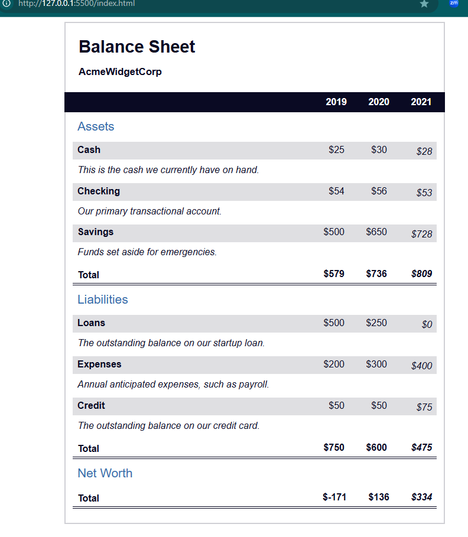

# Balance Sheet FreeCodeCamp Project

This project is part of the FreeCodeCamp curriculum and focuses on creating a simple **balance sheet** using HTML and CSS. The goal is to design a webpage that displays a balance sheet, which includes two main sections: **Assets** and **Liabilities**.

## Project Overview

In this project, we create a basic balance sheet layout with HTML and CSS. It includes two columns: one for assets and another for liabilities. The layout is styled to provide clear separation and visual structure, similar to a financial statement.

### Features
- Uses **HTML** for the structure of the balance sheet.
- **CSS** is used to style the sheet and ensure a clean, organized layout.
- Simple design to showcase basic knowledge of HTML and CSS.

## Screenshot

Here is a screenshot of the Balance Sheet project:



## How to Run

1. Clone the repository:
   ```bash
   git clone https://github.com/RusLena/balance-sheet.git
2. Open the project in a browser:
    Navigate to the folder and open the index.html file in any modern browser.